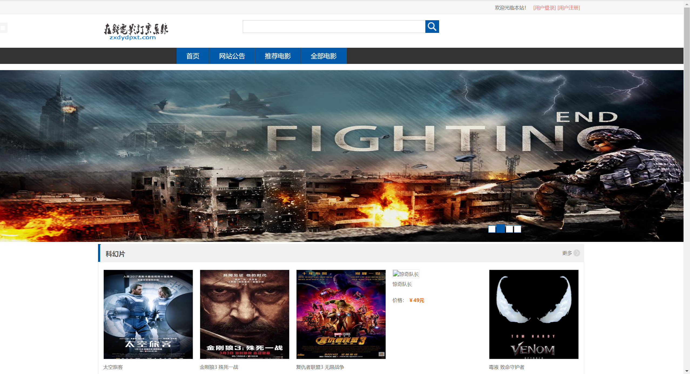
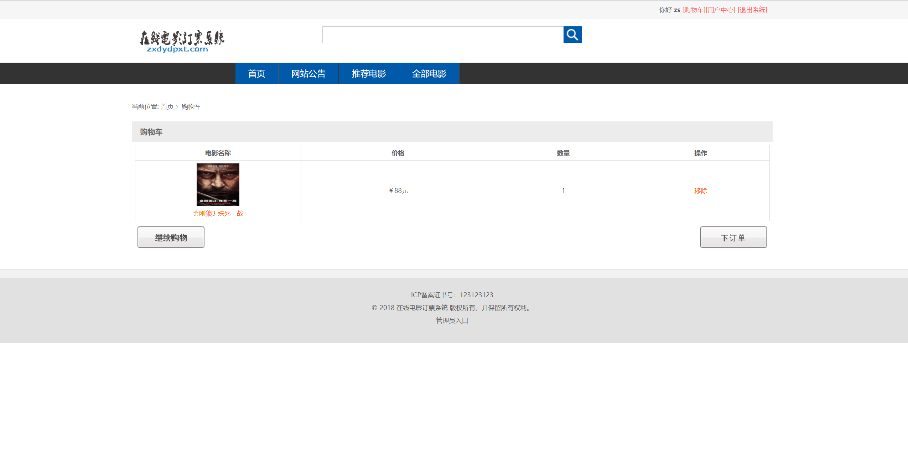
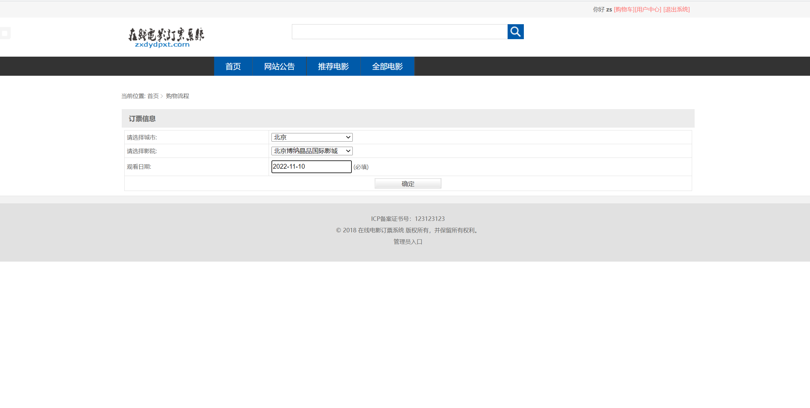
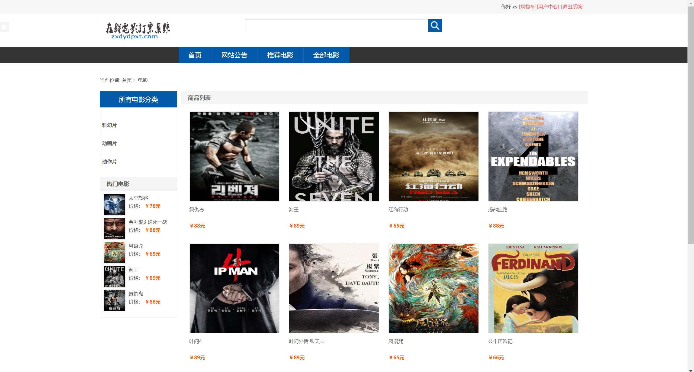
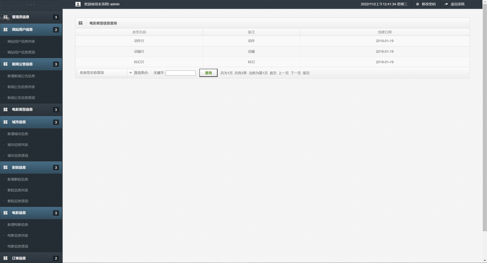
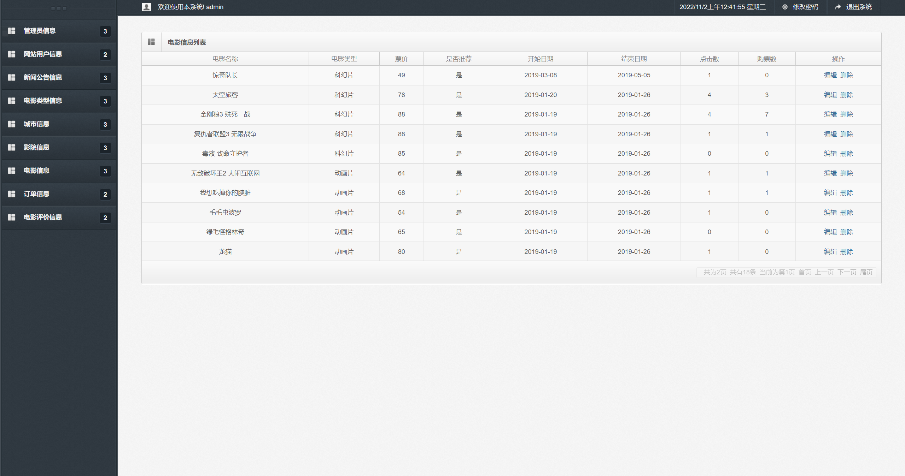
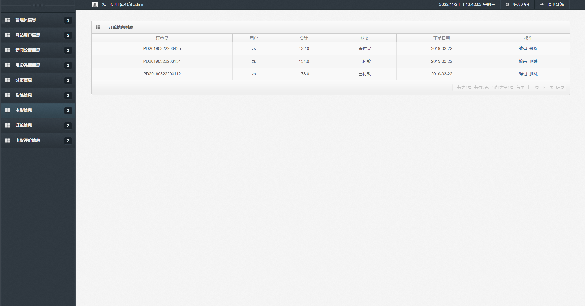
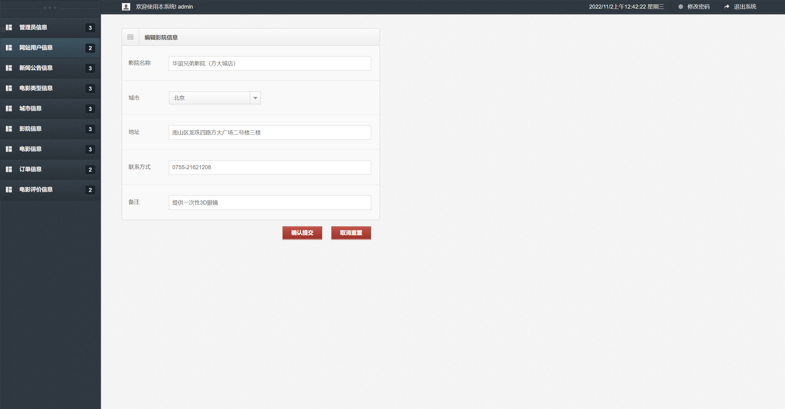

## 基于SSM的在线电影订票系统

- <b>完整代码获取地址：从戎源码网 ([https://armycodes.com/](https://armycodes.com/))</b>
- <b>技术探讨、资料分享，请加QQ群：692619798</b> 
- <b>作者微信：19941326836  QQ：952045282</b> 
- <b>承接计算机毕业设计、Java毕业设计、Python毕业设计、深度学习、机器学习</b>
- <b>选题+开题报告+任务书+程序定制+安装调试+论文+答辩ppt 一条龙服务</b>
- <b>所有选题地址 ([https://github.com/YuLin-Coder/AllProjectCatalog](https://github.com/YuLin-Coder/AllProjectCatalog)) </b>

## 项目介绍
基于SSM的在线电影订票系统，有用户和管理员两个角色，主要功能如下
在线电影订票系统的功能简介：

用户：

1. 电影列表展示：展示当前正在上映的电影列表。

2. 电影分类展示：按照不同的分类标准，展示电影的分类列表，如按照类型、地区、票价等。

3. 购票下单：用户可以选择心仪的电影并下单购买电影票。

4. 电影评论：用户可以对观影后的电影进行评论和评分。

5. 网站公告：展示网站的最新公告信息，包括特惠活动、电影上映时间等。

管理员：

1. 网站用户信息管理：管理用户的注册信息、登录状态、个人信息等。

2. 新闻公告管理：发布、编辑和删除网站发布的新闻公告信息。

3. 电影类型信息管理：管理电影的分类信息，包括添加、编辑和删除电影分类。

4. 电影所属城市管理：管理电影所属的城市信息，包括添加、编辑和删除城市信息。

5. 影院信息管理：管理影院的信息，包括添加、编辑和删除影院信息。

6. 电影信息管理：管理电影的详细信息，包括添加、编辑和删除电影信息。

7. 订单信息管理：管理用户的订单信息，包括查看订单、取消订单等操作。

8. 影评管理：管理用户对电影的评论和评分信息，包括查看评论、删除不合规的评论等。

## 项目技术
- 编程语言：Java
- 数据库：MySQL
- 前端技术：JSP、JavaScript、jquery
- 后端技术：Spring、SpringMVC、MyBatis

## 运行环境
- JDK版本：JDK1.8及以上
- 开发工具：IDEA、Ecplise、Myecplise都可以
- 数据库: MySQL5.7及以上

## 运行截图

